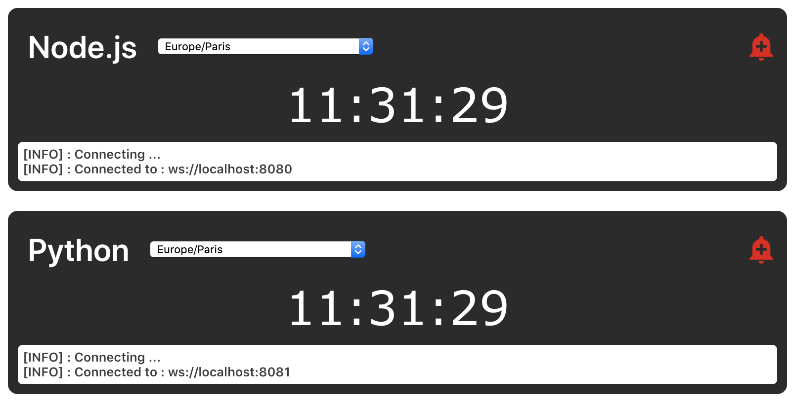

# Welcome to the Volta Clock !

The goal of this project is to have a React app displaying 2 clocks, both clocks are wired with websockets to differents backends, one in Python and the other in Node.js.

Backends store the Clients timezone and broadcast the time to them based on their timezone, there is a little alarm function which create a 10 sec alarm trigger.

## Getting Started

Clone this project

```
git clone https://github.com/arosiau/volta-clock.git
```

### Installation & Launch

This is what you need to launch the Volta Clock

#### backend-python

You need **Python 3.7+**, and **pipenv**

Let's go into the **backend-python** folder and retrieve the dependencies 

```
cd backend-python
pipenv install
```

Now you will normally be able to launch the backend-python

```
python clock.py
```

#### backend-node

You need a recent version of **Node.js** and **typescript** globally installed

```
npm i -g typescript
```

Let's go into the **backend-node** folder 

```
cd backend-node
npm i
```

Let's try to launch it

```
npm start
```

#### app

You need a recent version of **Node.js**

Let's go into the **app** folder 

```
cd app
npm i
```

Let's try to launch it

```
npm start
```

### Results

You should see something like this



### TODO list

Here is a quick list for each part on what could be improved

#### app

- Maybe some design :p
- Add a clock face view to play with html5 canvas and geometry
- Extend the alarm functionality because for now it's quite poor and is just there for the proof of concept

#### backend-node

- There might be a memory leak, we have to detect when a client disconnect and remove it from the users array. For now the disconnected user stay in the array and so never garbage collected